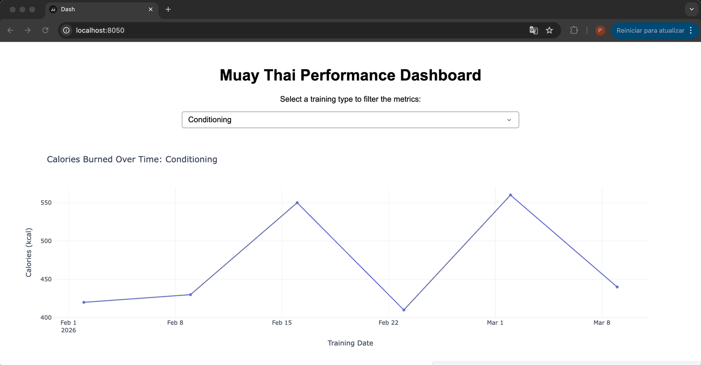

# Martial Arts Analytics Tracker

An interactive performance dashboard for tracking Muay Thai training sessions, built with Python, Dash, and Plotly.

<!-- Replace the line below with your actual GIF/screenshot after capturing it -->


---

## Features

- Filter training sessions by type using an interactive dropdown
- Visualize **calories burned over time** with an interactive line chart
- Clean and responsive layout powered by Plotly's `plotly_white` theme

---

## Tech Stack

| Tool | Purpose |
|---|---|
| [Dash](https://dash.plotly.com/) | Web application framework |
| [Plotly Express](https://plotly.com/python/plotly-express/) | Interactive charts |
| [Pandas](https://pandas.pydata.org/) | Data loading and filtering |

---

## Getting Started

### 1. Clone the repository

```bash
https://github.com/PauloMeneghini/Martial-Arts-Analytics-Tracker.git
cd Martial-Arts-Analytics-Tracker
```

### 2. Create and activate a virtual environment

```bash
python3 -m venv venv
source venv/bin/activate        # macOS/Linux
venv\Scripts\activate           # Windows
```

### 3. Install dependencies

```bash
pip install -r requirements.txt
```

### 4. Run the app

```bash
python app.py
```

Then open your browser at **http://127.0.0.1:8050**

---

## Project Structure

```
Martial-Arts-Analytics-Tracker/
├── app.py               # Main Dash application
├── training_data.csv    # Sample training dataset
├── requirements.txt     # Python dependencies
└── assets/              # Screenshots and GIFs for the README
```
